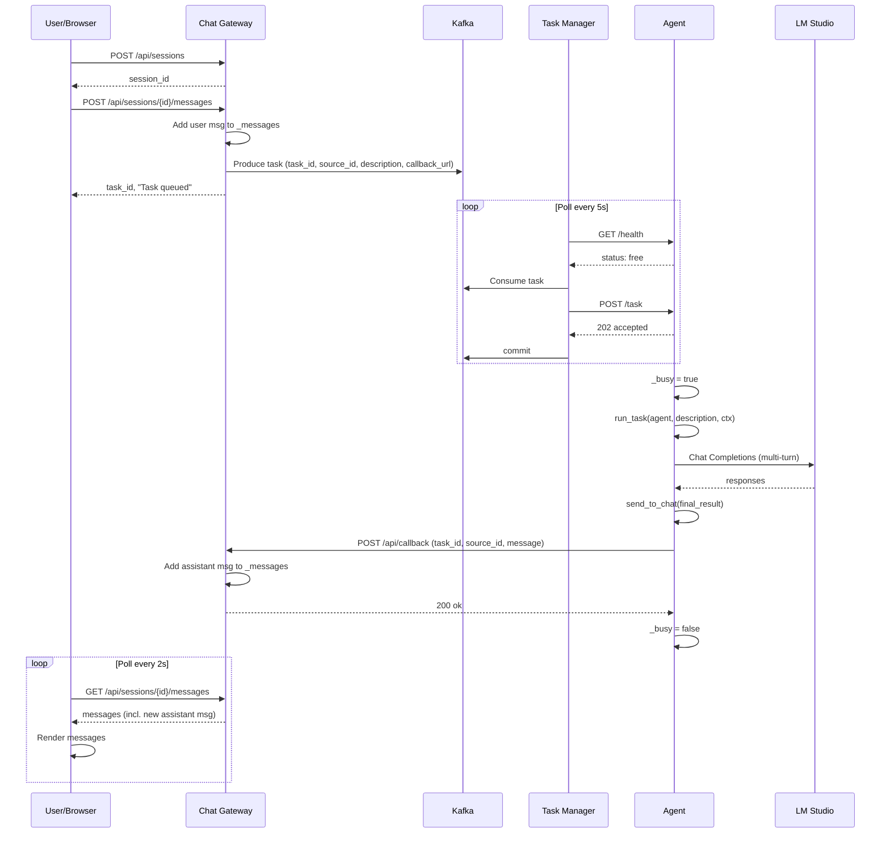

# Трассировка работы системы Auto Agent

**Версия:** 1.0  
**Дата:** 2025-03-07

Документ описывает полную трассировку прохождения задачи от пользователя до ответа.

---

## Обзор потока данных

```
[Пользователь] → [Chat Gateway] → [Kafka] → [Task Manager] → [Agent] → [LM Studio]
                                                                         ↓
[Пользователь] ← [Chat Gateway] ← [Callback] ← [send_to_chat tool] ← [Agent]
```

---

## Шаг 1: Инициализация сессии

| Компонент | Действие | Данные |
|-----------|----------|--------|
| **Браузер** | `POST /api/sessions` | — |
| **Chat Gateway** | Создаёт `session_id` (UUID), инициализирует `_messages[session_id] = []` | `CreateSessionResponse(session_id)` |
| **Браузер** | Запускает polling `GET /api/sessions/{session_id}/messages` каждые 2 сек | — |

**Файл:** `src/chat_gateway/main.py` → `create_session()`

---

## Шаг 2: Пользователь отправляет сообщение

| Компонент | Действие | Данные |
|-----------|----------|--------|
| **Браузер** | `POST /api/sessions/{session_id}/messages` | `{"content": "текст задачи"}` |
| **Chat Gateway** | 1. Генерирует `task_id` (UUID) | |
| | 2. Добавляет в `_messages[session_id]`: `{role: "user", content, task_id, timestamp}` | |
| | 3. Формирует `callback_url = {CALLBACK_BASE_URL}/api/callback` | |
| | 4. Отправляет в Kafka topic `tasks` | |

**Payload в Kafka:**
```json
{
  "task_id": "uuid",
  "source": "chat",
  "source_id": "session_id",
  "description": "текст задачи",
  "created_at": "2025-03-07T12:00:00Z",
  "callback_url": "http://localhost:8080/api/callback"
}
```

**Файл:** `src/chat_gateway/main.py` → `send_message()`

**Ответ:** `{"task_id": "...", "message": "Task queued"}`

---

## Шаг 3: Task Manager забирает задачу

| Компонент | Действие | Данные |
|-----------|----------|--------|
| **Task Manager** | Цикл каждые `POLL_INTERVAL_SEC` (по умолчанию 5 сек) | |
| | 1. `get_free_agent()`: опрашивает `GET /health` всех агентов из `AGENT_URLS` | |
| | 2. Ищет агента со `status: "free"` | |
| | 3. `consumer.getone()` — читает одно сообщение из Kafka topic `tasks` | |
| | 4. `assign_task()`: `POST {agent_url}/task` с телом задачи | |
| | 5. При успехе: `consumer.commit()` | |

**POST /task к агенту:**
```json
{
  "task_id": "uuid",
  "source": "chat",
  "source_id": "session_id",
  "description": "текст задачи",
  "callback_url": "http://localhost:8080/api/callback"
}
```

**Файл:** `src/task_manager/main.py` → `run_loop()`, `get_free_agent()`, `assign_task()`

**Конфиг:** `KAFKA_BOOTSTRAP_SERVERS`, `KAFKA_TOPIC`, `AGENT_URLS`, `TASK_MANAGER_POLL_INTERVAL`

---

## Шаг 4: Агент принимает задачу

| Компонент | Действие | Данные |
|-----------|----------|--------|
| **Agent API** | `POST /task` получает `TaskRequest` | |
| | 1. Проверяет `_busy` — если занят → 503 | |
| | 2. Устанавливает `_busy = True` | |
| | 3. Создаёт `TaskContext(task_id, source, source_id, callback_url)` | |
| | 4. Запускает `run_task(agent, description, ctx)` в фоне | |
| | 5. Сразу возвращает `202 {"status": "accepted", "task_id": "..."}` | |

**Файл:** `src/agent/api/main.py` → `accept_task()`

---

## Шаг 5: Выполнение задачи агентом

| Компонент | Действие | Данные |
|-----------|----------|--------|
| **Runner** | `Runner.run(agent, description, context=task_context, max_turns=10)` | |
| **Agent** | Загружает Skills из `skills/` (в т.ч. `general`, `business-requirements`) | |
| | Использует LM Studio (OpenAI-совместимый API) для генерации | |
| | Имеет tool: `send_to_chat(message)` | |
| **LM Studio** | Обрабатывает запросы Chat Completions | `base_url`, `model` |
| **Agent** | По завершении вызывает `send_to_chat(final_result)` | |

**Файлы:**
- `src/agent/core/runner.py` → `build_agent()`, `run_task()`
- `src/agent/infrastructure/skills_loader.py` → `load_skills()`
- `src/agent/infrastructure/lm_studio.py` → `create_lm_studio_model()`
- `src/agent/infrastructure/chat_callback_tool.py` → `create_send_to_chat_tool()`

**Конфиг:** `LM_STUDIO_URL`, `LM_STUDIO_MODEL`, `SKILLS_DIR`, `SKILLS_INCLUDE_USER`, `SKILLS_INCLUDE_PROJECT`

---

## Шаг 6: Отправка результата в чат (Callback)

| Компонент | Действие | Данные |
|-----------|----------|--------|
| **send_to_chat tool** | `POST callback_url` с JSON | |
| **Chat Gateway** | `POST /api/callback` получает `CallbackRequest` | |
| | 1. `session_id = req.source_id` | |
| | 2. Игнорирует служебные фразы (`"ok"`, `"delivered"`, и т.п.) | |
| | 3. Добавляет в `_messages[session_id]`: `{role: "assistant", content, task_id, timestamp}` | |
| | 4. Возвращает `{"status": "ok"}` | |

**Callback request body:**
```json
{
  "task_id": "uuid",
  "source_id": "session_id",
  "message": "Текст ответа агента"
}
```

**Файлы:**
- `src/agent/infrastructure/chat_callback_tool.py` → `send_to_chat()`
- `src/chat_gateway/main.py` → `callback()`

---

## Шаг 7: Отображение ответа пользователю

| Компонент | Действие | Данные |
|-----------|----------|--------|
| **Браузер** | Polling `GET /api/sessions/{session_id}/messages` каждые 2 сек | |
| **Chat Gateway** | Возвращает `{"messages": [...]}` | |
| **Браузер** | Рендерит новые сообщения в UI | |

**Файл:** `src/chat_gateway/main.py` → `get_messages()`, встроенный `CHAT_HTML`

---

## Диаграмма последовательности (Mermaid)



---

## Хранилища и состояния

| Компонент | Хранилище | Описание |
|-----------|-----------|----------|
| **Chat Gateway** | `_messages: Dict[session_id, List[dict]]` | In-memory: сообщения чата по сессиям |
| **Chat Gateway** | `_producer: AIOKafkaProducer` | Kafka producer |
| **Task Manager** | `AIOKafkaConsumer` | Kafka consumer, group_id: `task-manager` |
| **Agent** | `_busy: bool` | Флаг занятости агента |
| **Agent** | `_agent: Agent` | Lazy-initialized OpenAI Agents SDK agent |

---

## Переменные окружения

| Переменная | Компонент | По умолчанию |
|------------|-----------|--------------|
| `KAFKA_BOOTSTRAP_SERVERS` | Chat Gateway, Task Manager | `localhost:9092` |
| `KAFKA_TOPIC` / `KAFKA_TASKS_TOPIC` | Chat Gateway, Task Manager | `tasks` |
| `CHAT_CALLBACK_BASE_URL` | Chat Gateway | `http://localhost:8080` |
| `AGENT_URLS` | Task Manager | `http://localhost:8000` |
| `TASK_MANAGER_POLL_INTERVAL` | Task Manager | `5` |
| `LM_STUDIO_URL` | Agent | `http://localhost:1234/v1` |
| `LM_STUDIO_MODEL` | Agent | `local-model` |
| `SKILLS_DIR` | Agent | (project `skills/`, `~/.claude/skills`) |

---

## Порты по умолчанию

| Сервис | Порт |
|--------|------|
| Chat Gateway | 8080 |
| Agent | 8000 |
| Kafka | 9092 |
| LM Studio | 1234 |
