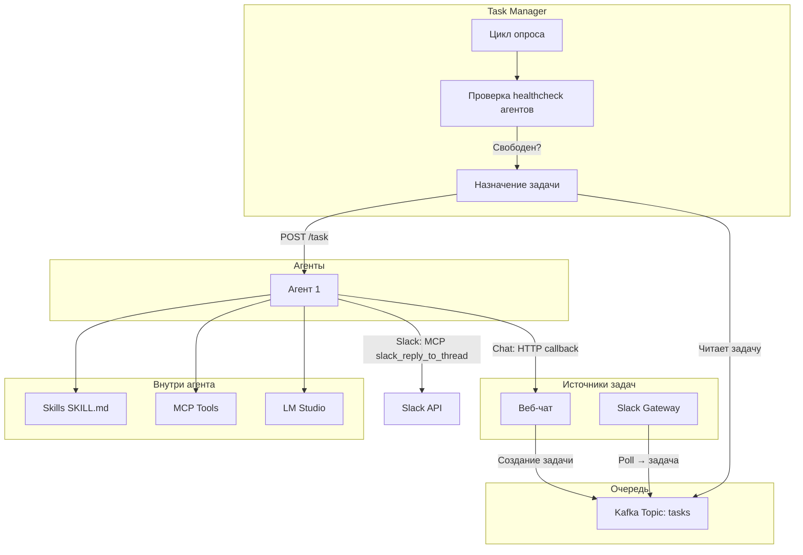

# Архитектура системы

**Версия:** 1.0  
**Дата:** 2025-03-07

## Обзор

Система состоит из четырёх основных компонентов: Chat Gateway, Kafka, Task Manager и Agent(s).

## Диаграмма потока данных



## Компоненты

### 1. Chat Gateway

- REST API для создания задач.
- Веб-интерфейс чата (HTML/JS).
- Запись задач в Kafka (topic `tasks`).
- HTTP callback endpoint для получения ответов от агента.

### 2. Kafka

- Topic `tasks` — очередь входящих задач.
- Формат сообщения: JSON с полями `task_id`, `source`, `source_id`, `description`, `created_at`.

### 3. Task Manager

- Асинхронный цикл (asyncio) с интервалом опроса.
- Опрос `GET /health` всех агентов из конфига.
- При наличии свободного агента: consume из Kafka, POST задачи на `/task` агента.

### 4. Agent

- FastAPI: `GET /health` (возвращает `busy` или `free`), `POST /task` (принимает задачу).
- OpenAI Agents SDK с LM Studio (OpenAI-совместимый API).
- Загрузка Skills из папки `skills/`.
- **MCP Slack** — для ответов в Slack: агент вызывает `slack_reply_to_thread` через MCP.
- **HTTP callback** — для ответов в веб-чат: function tool `send_to_chat` выполняет POST.
- При выполнении задачи — статус `busy`, по завершении — `free`.

## Формат сообщения Kafka

```json
{
  "task_id": "uuid",
  "source": "chat",
  "source_id": "chat_session_123",
  "description": "Текст задачи",
  "created_at": "2025-03-07T12:00:00Z"
}
```

## ADR (Architecture Decision Records)

### ADR-001: Использование OpenAI Agents SDK

**Решение:** Использовать OpenAI Agents SDK для реализации агента.

**Обоснование:** SDK поддерживает MCP, function tools, Chat Completions API (совместим с LM Studio).

### ADR-002: LM Studio как LLM-провайдер

**Решение:** Использовать LM Studio через OpenAI-совместимый API.

**Обоснование:** Локальные модели, отсутствие облачных затрат, полный контроль над данными.

### ADR-003: HTTP callback для веб-чата, MCP для Slack

**Решение:**
- **Веб-чат:** Агент вызывает HTTP callback (POST) через function tool `send_to_chat`.
- **Slack:** Агент вызывает MCP tool `slack_reply_to_thread` — взаимодействие со Slack идёт через MCP, а не через HTTP callback.

**Обоснование:** Slack MCP даёт агенту прямой доступ к Slack API (ответы в треды, реакции, история). Пуллинг из Slack в Kafka остаётся без изменений; меняется только способ доставки ответа.
