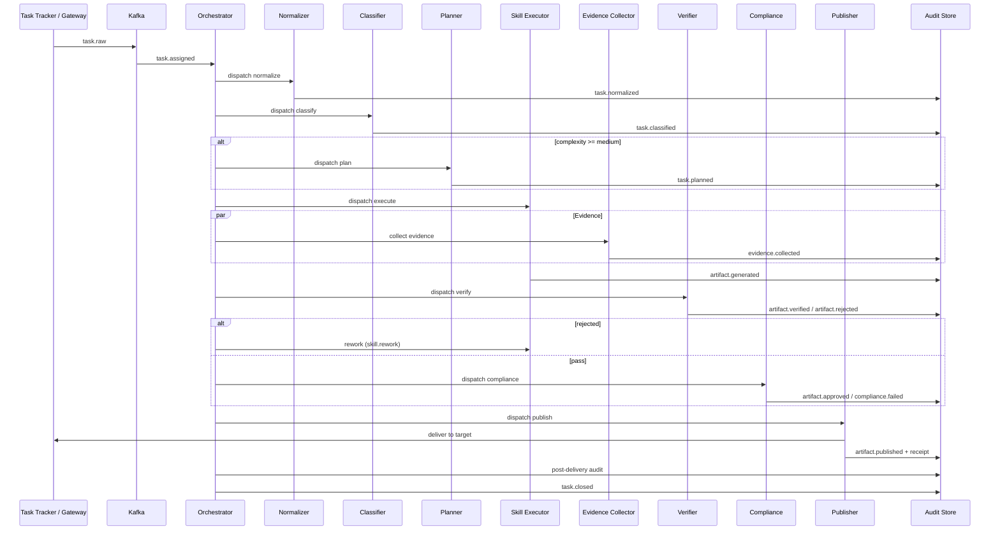

# Multi-Agent Architecture: Enterprise Autonomous Agent Platform

**Версия:** 1.0  
**Дата:** 2026-07-12  
**Статус:** Implemented (Temporal.io orchestrator in `src/orchestrator/`)  
**Базовая платформа:** `auto_agent` (Kafka, Task Manager → Temporal, Skills, MCP delivery)

---

## 1. Executive summary

- **Рекомендуемый архитектурный стиль:** *Event-driven orchestration с typed artifact pipeline* — центральный Orchestrator координирует lifecycle задачи через Kafka event bus; sub-agents — stateless workers с явными handoff-контрактами; артефакты — версионируемые typed documents, а не свободный текст в памяти агента.
- Текущий single ReAct Agent с Skills и `delivery_resolver` эволюционирует в **Control Plane (Orchestrator + Event Store + Audit DB)** и **Execution Plane (specialized sub-agent pools)**, сохраняя существующие gateways (Jira, Slack, Chat) как intake/delivery adapters.
- **Независимая верификация обязательна:** Verifier Agent — отдельный worker pool с отдельным system prompt, без доступа к chain-of-thought Executor; получает только артефакт + evidence bundle + skill rubric.
- **Quality gates — blocking checkpoints** между фазами: нормализация → план → исполнение → verification → compliance → publication; переход без PASS запрещён.
- **Delivery через Publisher Agent + adapter pattern** (расширение `delivery_resolver`): каждая публикация получает receipt (external_id, checksum, timestamp); post-publish verification обязательна для Jira/wiki/PR.
- **Shared state:** Task Run Record (PostgreSQL) + Artifact Store (object storage / DB) + Event Log (Kafka topics); in-memory контекст sub-agent запрещён как source of truth.
- **Retry/rework/escalation** управляются Orchestrator по политикам (max retries, exponential backoff, human-in-the-loop на escalation).
- **MVP (4–6 недель):** Orchestrator, Normalizer, Classifier, Skill Executor, Verifier, Publisher — 6 sub-agents; Compliance и Evidence Collector встроены в Executor/Verifier.
- **Target state:** 11 sub-agents, отдельный Compliance Agent, dedicated Evidence Collector, event sourcing, idempotency keys, distributed tracing (OpenTelemetry).
- **Topology подходит для enterprise**, потому что обеспечивает: isolation of responsibilities, audit trail by design, independent QA, extensible delivery targets, horizontal scaling worker pools, и fail-safe escalation без silent failures.

| Решение | Recommended | Rejected alternative | Rationale |
|---------|-------------|------------------------|-----------|
| Координация | Central Orchestrator + event bus | Peer-to-peer agent swarm | Предсказуемые transitions, audit, retry |
| Верификация | Independent Verifier pool | Self-check Executor | Anti-reward-hacking, независимая оценка |
| Handoffs | Typed artifacts + JSON Schema | Free-form chat между агентами | Traceability, deterministic validation |
| State | PostgreSQL + Kafka events | Agent memory / shared Redis only | Durability, replay, compliance |
| Delivery | Publisher + receipt | Direct MCP из Executor | Idempotency, rollback, post-verify |

---

## 2. Sub-agent catalog

### 2.1. Сводная таблица

| # | Sub-agent | Mandatory | Trigger |
|---|-----------|-----------|---------|
| 1 | Orchestrator | ✅ | `task.assigned` |
| 2 | Intake Normalizer | ✅ | `task.assigned` |
| 3 | Task Classifier & Router | ✅ | `task.normalized` |
| 4 | Planner / Decomposer | ⚡ Conditional | `task.classified` (complexity ≥ medium) |
| 5 | Skill Executor | ✅ | `task.planned` / `skill.assigned` |
| 6 | Evidence Collector | ✅ (embedded MVP → dedicated prod) | parallel with `skill.started` |
| 7 | Independent Verifier | ✅ | `artifact.generated` |
| 8 | Compliance & Policy Validator | ✅ (lite MVP → full prod) | `artifact.verified` |
| 9 | Publisher / Delivery Agent | ✅ | `artifact.approved` |
| 10 | Escalation Handler | ✅ | `escalation.requested` |
| 11 | Audit & Trace Agent | ✅ (infra MVP → agent prod) | all events |

---

### 2.2. Детальный каталог

#### 2.2.1. Orchestrator

| Поле | Значение |
|------|----------|
| **Purpose** | Управление lifecycle задачи, state machine, retry/rework/escalation, dispatch sub-agents |
| **Inputs** | Raw task from Kafka (`TaskMessage`), policy config, run history |
| **Outputs** | Dispatch commands, state transitions, `task.*` events |
| **Trigger** | `task.assigned` (from Task Manager / Intake Gateway) |
| **Tools/integrations** | Kafka (consume/produce), PostgreSQL (Task Run Record), Agent Worker API |
| **Failure modes** | Lost message, duplicate dispatch, stale state, timeout waiting sub-agent |
| **Success criteria** | Task reaches `closed` or `escalated` with complete audit trail |
| **Mandatory** | ✅ |

#### 2.2.2. Intake Normalizer

| Поле | Значение |
|------|----------|
| **Purpose** | Приведение задачи из Jira/Slack/Chat к canonical Task Spec |
| **Inputs** | Raw `TaskMessage`, source metadata (issue fields, thread history, attachments) |
| **Outputs** | `NormalizedTaskSpec` (title, description, constraints, links, language, priority, source_refs) |
| **Trigger** | Orchestrator dispatch после `task.assigned` |
| **Tools/integrations** | Jira MCP (read issue), Slack MCP (thread history), Chat Gateway API |
| **Failure modes** | Incomplete source data, ambiguous scope, missing attachments |
| **Success criteria** | Valid `NormalizedTaskSpec` passes JSON Schema; blocking fields present |
| **Mandatory** | ✅ |

#### 2.2.3. Task Classifier & Router

| Поле | Значение |
|------|----------|
| **Purpose** | Определение skill(s), complexity, delivery target, verification profile |
| **Inputs** | `NormalizedTaskSpec` |
| **Outputs** | `RoutingDecision` (primary_skill, secondary_skills[], complexity, delivery_target, verifier_rubric_id) |
| **Trigger** | `task.normalized` |
| **Tools/integrations** | LLM classification prompt + deterministic rules (keyword/skill metadata from SKILL.md frontmatter) |
| **Failure modes** | Misclassification, multi-skill ambiguity, unsupported task type |
| **Success criteria** | Confidence ≥ threshold OR routed to `general` with human-review flag; rubric matched |
| **Mandatory** | ✅ |

**Skill routing map (deterministic fallback):**

| Skill | Triggers (keywords / intent) | Output artifact type |
|-------|------------------------------|----------------------|
| `business-requirements` | BRD, PRD, user stories, acceptance criteria | `BusinessRequirementsDoc` |
| `system-requirements` | SRS, NFR, architecture constraints, API spec | `SystemRequirementsDoc` |
| `test-case-design` | test cases, test plan, coverage | `TestCasePack` |
| `code-analysis` | code review, static analysis, security scan | `CodeAnalysisReport` |

#### 2.2.4. Planner / Decomposer

| Поле | Значение |
|------|----------|
| **Purpose** | Декомposition multi-step задач; определение sub-tasks, dependencies, acceptance per step |
| **Inputs** | `NormalizedTaskSpec`, `RoutingDecision` |
| **Outputs** | `ExecutionPlan` (steps[], skill_per_step, evidence_requirements[], estimated_iterations) |
| **Trigger** | `task.classified` when complexity ∈ {medium, high} OR multiple skills |
| **Tools/integrations** | LLM planning; read-only access to wiki/Confluence for context |
| **Failure modes** | Over-decomposition, circular deps, plan drift |
| **Success criteria** | Plan validated: DAG acyclic, each step has skill + done criteria |
| **Mandatory** | ⚡ Conditional (optional for simple/low complexity) |

#### 2.2.5. Skill Executor

| Поле | Значение |
|------|----------|
| **Purpose** | Production артефакта по SKILL.md; единственный agent с write-access к draft artifact |
| **Inputs** | `ExecutionPlan` or direct skill assignment, `NormalizedTaskSpec`, evidence bundle (read) |
| **Outputs** | `ArtifactDraft` (typed content, metadata, provenance, skill_version) |
| **Trigger** | `task.planned` or `skill.assigned` |
| **Tools/integrations** | Skills loader (existing), MCP (Jira/Slack read, repo read, wiki), LLM (GigaChat/LM Studio) |
| **Failure modes** | Hallucination, incomplete template, tool timeout, context overflow |
| **Success criteria** | Draft passes structural schema validation (deterministic pre-check before verify) |
| **Mandatory** | ✅ |

#### 2.2.6. Evidence Collector

| Поле | Значение |
|------|----------|
| **Purpose** | Сбор verifiable evidence: source excerpts, code snippets, links, tool outputs |
| **Inputs** | Task refs, repo paths, Jira fields, Confluence pages |
| **Outputs** | `EvidenceBundle` (items[]: {type, source_uri, excerpt, checksum, collected_at}) |
| **Trigger** | Parallel with `skill.started`; mandatory before `artifact.generated` |
| **Tools/integrations** | Git MCP, Jira MCP, Confluence API, file fetch |
| **Failure modes** | Stale repo snapshot, missing permissions, truncated fetch |
| **Success criteria** | All `evidence_requirements` from plan satisfied OR gap logged with escalation flag |
| **Mandatory** | ✅ (MVP: embedded in Executor; Prod: dedicated read-only agent) |

#### 2.2.7. Independent Verifier

| Поле | Значение |
|------|----------|
| **Purpose** | Независимая оценка качества артефакта по rubric; не исполняет skill повторно |
| **Inputs** | `ArtifactDraft`, `EvidenceBundle`, `VerifierRubric`, `NormalizedTaskSpec` (NOT executor CoT) |
| **Outputs** | `VerificationReport` (status: pass/fail/rework, scores[], findings[], required_fixes[]) |
| **Trigger** | `artifact.generated` |
| **Tools/integrations** | LLM (separate model instance/prompt), deterministic validators |
| **Failure modes** | Lenient verifier, false pass, rubric mismatch |
| **Success criteria** | PASS only if all blocking criteria met; findings linked to artifact sections |
| **Mandatory** | ✅ |

#### 2.2.8. Compliance & Policy Validator

| Поле | Значение |
|------|----------|
| **Purpose** | Enterprise policy: PII, secrets, license headers, approved templates, data residency |
| **Inputs** | Verified artifact, org policy rules (YAML/OPA) |
| **Outputs** | `ComplianceReport` (pass/fail, violations[]) |
| **Trigger** | `artifact.verified` with status=pass |
| **Tools/integrations** | OPA/Rego or rule engine, secret scanner, PII detector |
| **Failure modes** | False negative on secrets, policy version drift |
| **Success criteria** | Zero blocking violations |
| **Mandatory** | ✅ (MVP: deterministic rules only; Prod: + LLM semantic policy check) |

#### 2.2.9. Publisher / Delivery Agent

| Поле | Значение |
|------|----------|
| **Purpose** | Format + publish artifact to target system; obtain receipt |
| **Inputs** | Approved artifact, `DeliveryTarget` (from routing), format template |
| **Outputs** | `PublicationReceipt` (target, external_id, url, checksum, published_at) |
| **Trigger** | `artifact.approved` |
| **Tools/integrations** | Extended `delivery_resolver`: Jira MCP (comment/update), Confluence, Git PR, Slack, KB API |
| **Failure modes** | Partial publish, format incompatibility, API rate limit, duplicate publish |
| **Success criteria** | Receipt obtained + post-publish verify PASS |
| **Mandatory** | ✅ |

#### 2.2.10. Escalation Handler

| Поле | Значение |
|------|----------|
| **Purpose** | Human-in-the-loop: notify owner, attach context pack, pause/resume task |
| **Inputs** | Escalation reason, full trace bundle (task + artifacts + reports) |
| **Outputs** | `EscalationTicket`, notification, task state → `escalated` |
| **Trigger** | Max retries exceeded, compliance block, ambiguous classification, verifier deadlock |
| **Tools/integrations** | Jira (create escalation issue), Slack (notify channel), email |
| **Failure modes** | Notification lost, no human response |
| **Success criteria** | Ticket created with trace_id; task frozen until human resolution event |
| **Mandatory** | ✅ |

#### 2.2.11. Audit & Trace Agent (Infrastructure)

| Поле | Значение |
|------|----------|
| **Purpose** | Immutable audit log, correlation IDs, replay support |
| **Inputs** | All domain events |
| **Outputs** | Audit records, metrics, dashboards |
| **Trigger** | Every event |
| **Tools/integrations** | PostgreSQL audit table, Kafka compacted topic, OpenTelemetry |
| **Failure modes** | Audit gap, clock skew |
| **Success criteria** | 100% event persistence; reconstruct run from events |
| **Mandatory** | ✅ (MVP: service module; Prod: dedicated pipeline) |

---

## 3. End-to-end workflow



### 3.1. Task intake

1. Gateway (Jira / Slack / Chat — существующие) создаёт `TaskMessage` в Kafka topic `tasks.raw`.
2. Task Manager (эволюция → **Assignment Service**) резервирует Orchestrator slot, эмитит `task.assigned` с `trace_id`, `idempotency_key`.
3. **Gate G0 (Intake):** duplicate `idempotency_key` → attach to existing run, не создавать новый.

### 3.2. Classification / routing

1. Normalizer → canonical spec.
2. Classifier → skill + delivery target + verifier rubric.
3. **Gate G1 (Routing):** unknown skill + low confidence → escalation OR `general` with mandatory human review flag.

### 3.3. Planning / decomposition

1. Optional для simple tasks: Orchestrator создаёт trivial plan (1 step = 1 skill).
2. Planner для complex: multi-step DAG.
3. **Gate G2 (Plan):** invalid DAG / missing done criteria → replan (max 2) → escalation.

### 3.4. Skill execution

1. Executor получает plan step + skill binding (SKILL.md content injected).
2. Evidence Collector параллельно наполняет bundle.
3. Executor produces `ArtifactDraft v1`.
4. **Gate G3 (Structural):** JSON Schema + template completeness → fail fast to rework без вызова Verifier.

### 3.5. Evidence collection

- Каждый claim в артефакте SHOULD ссылаться на `evidence_id` (traceability).
- Verifier проверяет coverage: unsupported claims → REWORK.

### 3.6. Verification

1. Independent Verifier (отдельный pod, другой prompt).
2. Semantic validation по rubric + deterministic checks.
3. **Gate G4 (Quality):** PASS / REWORK / FAIL(escalate).

### 3.7. Compliance / policy validation

1. Deterministic: secrets, PII patterns, required sections.
2. Semantic (prod): license, regulatory language.
3. **Gate G5 (Compliance):** blocking violations → rework or escalate (non-auto-fixable).

### 3.8. Publication / delivery

1. Publisher selects adapter by `delivery_target`.
2. Formats artifact → publishes → stores receipt.
3. **Gate G6 (Delivery):** receipt required; no receipt → `delivery.failed`, retry with backoff.

### 3.9. Post-delivery audit

1. Post-publish verify: read-back from target (Jira comment exists, Confluence page version, PR created).
2. Mismatch → `delivery.failed` → retry or rollback flow.

### 3.10. Retry / rework / escalation

| Condition | Action | Max attempts |
|-----------|--------|--------------|
| Structural validation fail | Rework → Executor | 3 |
| Verifier REWORK | Rework with `required_fixes` | 3 |
| Verifier FAIL (critical) | Escalate | 1 |
| Compliance violation (auto-fixable) | Rework | 2 |
| Compliance violation (policy) | Escalate | 0 |
| Delivery fail | Retry Publisher | 5 (exponential backoff) |
| Sub-agent timeout | Retry same stage | 2 → escalate |

---

## 4. Control architecture

### 4.1. Orchestrator responsibilities

| Responsibility | Owner |
|----------------|-------|
| State machine enforcement | Orchestrator |
| Sub-agent dispatch | Orchestrator |
| Retry/rework policy | Orchestrator |
| Timeout management | Orchestrator |
| Idempotency | Orchestrator |
| Skill execution | Skill Executor |
| Quality judgment | Verifier (NOT Orchestrator) |
| Publishing | Publisher (NOT Executor) |

Orchestrator **не генерирует контент** и **не верифицирует качество** — только координирует.

### 4.2. Handoff contracts

Каждый handoff — typed message + JSON Schema version:

```
task.assigned     → NormalizedTaskSpec v1
task.normalized   → RoutingDecision v1
task.planned      → ExecutionPlan v1
skill.assigned    → SkillExecutionContext v1
artifact.generated→ ArtifactDraft v1
artifact.verified → VerificationReport v1
artifact.approved → ApprovedArtifact v1
artifact.published→ PublicationReceipt v1
```

**Contract rules:**
- Producer increments `artifact_version` on every rework.
- Consumer rejects unknown schema version → dead-letter + escalate.
- All payloads include: `trace_id`, `task_id`, `run_id`, `idempotency_key`, `created_at`, `producer_agent`.

### 4.3. Shared state / memory model

| Store | Content | Retention |
|-------|---------|-----------|
| **Task Run Record** (PostgreSQL) | Current state, retry counters, assignments | 7 years (audit) |
| **Artifact Store** (S3/MinIO or PG JSONB) | All artifact versions, evidence bundles | Versioned, immutable writes |
| **Event Log** (Kafka) | Domain events, compacted by task_id | Configurable, min 90 days |
| **Policy Store** | Rubrics, compliance rules, skill versions | Git-versioned |
| **Agent scratchpad** | Ephemeral LLM context | ❌ NOT source of truth |

**Memory rule:** sub-agent MAY use local context during execution, but MUST persist outputs to Artifact Store before acknowledging completion.

### 4.4. Artifact model

```
ArtifactDraft:
  artifact_id: uuid
  task_id: uuid
  run_id: uuid
  type: enum [BusinessRequirementsDoc, SystemRequirementsDoc, TestCasePack, CodeAnalysisReport]
  skill: string
  skill_version: semver
  version: int
  content: structured JSON (not opaque markdown)
  content_checksum: sha256
  evidence_refs: [evidence_id]
  provenance: { model, prompt_hash, tools_used[] }
  created_by: skill-executor
  created_at: ISO8601
```

Structured content enables deterministic validation (required sections, field types).

### 4.5. Idempotency strategy

- **Intake:** `idempotency_key = hash(source + source_id + description_hash)` — duplicate intake attaches to existing run.
- **Dispatch:** Orchestrator stores `stage_attempt_id`; sub-agent receives it; duplicate dispatch with same ID → return cached result.
- **Publish:** `publish_idempotency_key = hash(task_id + artifact_version + target)` — Publisher checks target for existing publish before write.

### 4.6. Audit trail

Каждое событие записывает:

```json
{
  "event_id": "uuid",
  "trace_id": "uuid",
  "task_id": "uuid",
  "run_id": "uuid",
  "event_type": "artifact.verified",
  "producer": "verifier-agent",
  "payload_hash": "sha256",
  "timestamp": "ISO8601",
  "prev_event_id": "uuid"
}
```

Chain hashing (prev_event_id) для tamper detection (prod).

### 4.7. Timeout / retry policy

| Stage | Timeout | Retry |
|-------|---------|-------|
| Normalize | 2 min | 2 |
| Classify | 1 min | 2 |
| Plan | 3 min | 2 |
| Execute | 15 min (skill-dependent) | 1 (+ rework loop) |
| Verify | 5 min | 2 |
| Compliance | 2 min | 1 |
| Publish | 3 min | 5 |

Orchestrator uses circuit breaker per sub-agent pool (3 consecutive failures → pause + alert).

### 4.8. Human-in-the-loop checkpoints

| Checkpoint | When | Mandatory |
|------------|------|-----------|
| HITL-1 Classification override | confidence < 0.7 | Optional (auto-route to general) |
| HITL-2 Pre-publish approval | high-risk tasks (config flag) | Configurable |
| HITL-3 Escalation resolution | escalated state | ✅ Mandatory |
| HITL-4 Compliance exception | policy exception needed | ✅ Mandatory |

---

## 5. Quality assurance model

### 5.1. Reviewer / verifier pattern

```
Executor (producer) ──→ ArtifactDraft
                              │
                              ▼
Verifier (independent) ──→ VerificationReport
         ↑                        │
         │                        ▼
   EvidenceBundle            Compliance
   VerifierRubric                 │
                                  ▼
                            ApprovedArtifact
```

**Isolation requirements:**
- Verifier pod: no access to Executor system prompt or scratchpad.
- Different LLM temperature (lower for Verifier: 0–0.2).
- Verifier rubric loaded from Policy Store, not from Executor output.

### 5.2. Semantic validation

- LLM-based rubric scoring per section (completeness, clarity, alignment with task).
- Cross-check: claims in artifact vs evidence bundle excerpts.
- Skill-specific rubrics (e.g. BRD must have ≥3 measurable goals, user stories with acceptance criteria).

### 5.3. Deterministic validation

| Check | Applies to |
|-------|------------|
| JSON Schema validation | All artifacts |
| Required sections present | All skills |
| No empty P0 requirements | business/system requirements |
| Test cases have steps + expected result | test-case-design |
| Findings reference file:line | code-analysis |
| Secret/PII regex scan | All |
| Max length / token budget | All |

Deterministic checks run **before** semantic verification (cheap gate).

### 5.4. Quality gates summary

| Gate | Stage | Type | Blocking |
|------|-------|------|----------|
| G0 | Intake | Idempotency | ✅ |
| G1 | Routing | Classification confidence | ✅ |
| G2 | Planning | Plan validity | ✅ |
| G3 | Execution | Structural schema | ✅ |
| G4 | Verification | Verifier PASS | ✅ |
| G5 | Compliance | Policy PASS | ✅ |
| G6 | Delivery | Receipt + read-back | ✅ |

### 5.5. Pass / fail / rework statuses

| Status | Meaning | Next step |
|--------|---------|-----------|
| PASS | All blocking criteria met | Advance |
| REWORK | Fixable issues, `required_fixes` provided | Executor retry with fixes |
| FAIL | Critical quality failure | Escalate |
| WAIVED | Human override (audit logged) | Advance with waiver record |

### 5.6. Anti-hallucination controls

- Mandatory evidence refs for factual claims.
- Verifier cross-checks evidence coverage score ≥ threshold (e.g. 80%).
- Tool-grounded execution: code-analysis MUST use repo MCP, not model memory.
- `provenance.tools_used` audited; missing tool calls for code tasks → auto REWORK.

### 5.7. Anti-reward-hacking controls

- Executor never calls Verifier tools.
- Verifier prompt: "Do not assume good intent; fail if evidence missing."
- Random audit sample (5%): human review of PASS decisions.
- Separate model/prompt for Verifier vs Executor.
- No single metric optimization (avoid "PASS rate" as KPI for Verifier).

---

## 6. Delivery architecture

### 6.1. Publishing targets

| Target | Source | Adapter | Format |
|--------|--------|---------|--------|
| Task tracker (Jira) | `source=jira` | `JiraDeliveryAdapter` | ADF/markdown comment or field update |
| Wiki (Confluence) | routing config | `ConfluenceDeliveryAdapter` | Storage format XHTML |
| Docs (Git repo) | routing config | `GitDeliveryAdapter` | Markdown PR |
| Code review (Git PR comment) | code-analysis | `GitReviewAdapter` | Review comments |
| Knowledge base | routing config | `KBDeliveryAdapter` | Structured article |
| Slack / Chat | `source=slack/chat` | Existing MCP + callback | Thread message |

### 6.2. Formatter / adapter pattern

```
ApprovedArtifact
       │
       ▼
DeliveryRouter (extends delivery_resolver)
       │
       ├── JiraDeliveryAdapter.format() → publish() → verify_readback()
       ├── ConfluenceDeliveryAdapter
       └── ...
       │
       ▼
PublicationReceipt
```

Each adapter implements:
- `format(artifact, target_config) → payload`
- `publish(payload) → external_id`
- `verify_readback(external_id, checksum) → bool`
- `rollback(external_id)` (where API supports)

### 6.3. Publication receipt

```json
{
  "receipt_id": "uuid",
  "task_id": "uuid",
  "artifact_id": "uuid",
  "artifact_version": 2,
  "target": "jira",
  "external_id": "PROJ-123-comment-456789",
  "url": "https://...",
  "content_checksum": "sha256",
  "published_at": "ISO8601",
  "publish_idempotency_key": "hash"
}
```

Task cannot transition to `delivered` without receipt.

### 6.4. Post-publish verification

1. Read-back content from target API.
2. Normalize and compare checksum with published artifact.
3. On mismatch: `delivery.failed` → retry (max 5) → escalate.

### 6.5. Rollback / correction flow

1. If publish partially succeeded (e.g. comment created but wrong format): Publisher calls `rollback()` or posts correction comment with `[AUTO-CORRECTION]` prefix.
2. New artifact version required for content fixes (not in-place silent edit).
3. All corrections append to audit trail with link to superseded receipt.

---

## 7. Recommended event model

### 7.1. Kafka topics

| Topic | Purpose |
|-------|---------|
| `tasks.raw` | Inbound from gateways |
| `tasks.events` | Domain events (main bus) |
| `tasks.dlq` | Dead letters |
| `tasks.commands` | Orchestrator → worker dispatch |

### 7.2. Event catalog

| Event | Producer | Consumer(s) | When emitted |
|-------|----------|-------------|--------------|
| `task.assigned` | Assignment Service | Orchestrator, Audit | Task accepted from gateway |
| `task.normalized` | Normalizer | Orchestrator, Audit | Canonical spec ready |
| `task.classified` | Classifier | Orchestrator, Audit | Routing decision made |
| `task.planned` | Planner | Orchestrator, Audit | Execution plan approved |
| `skill.assigned` | Orchestrator | Skill Executor, Audit | Step dispatched |
| `skill.started` | Skill Executor | Evidence Collector, Audit | Execution begun |
| `evidence.collected` | Evidence Collector | Verifier, Audit | Bundle complete |
| `skill.completed` | Skill Executor | Orchestrator, Audit | Step done (no quality judgment) |
| `artifact.generated` | Skill Executor | Orchestrator, Audit | Draft persisted |
| `artifact.verified` | Verifier | Orchestrator, Audit | PASS |
| `artifact.rejected` | Verifier | Orchestrator, Audit | REWORK or FAIL |
| `artifact.approved` | Compliance | Orchestrator, Audit | Compliance PASS |
| `compliance.failed` | Compliance | Orchestrator, Audit | Blocking violation |
| `artifact.published` | Publisher | Orchestrator, Audit | Receipt stored |
| `delivery.failed` | Publisher | Orchestrator, Audit | Publish/verify fail |
| `escalation.requested` | Orchestrator | Escalation Handler, Audit | Retries exhausted / policy |
| `escalation.resolved` | Human/API | Orchestrator, Audit | Human decision |
| `task.closed` | Orchestrator | Audit, Metrics | Successful completion |
| `task.failed` | Orchestrator | Audit, Alerting | Terminal failure |

### 7.3. Payload outline (example: `artifact.verified`)

```json
{
  "event_type": "artifact.verified",
  "event_id": "uuid",
  "trace_id": "uuid",
  "task_id": "uuid",
  "run_id": "uuid",
  "timestamp": "ISO8601",
  "producer": "verifier-agent",
  "payload": {
    "artifact_id": "uuid",
    "artifact_version": 1,
    "verification_report_id": "uuid",
    "status": "pass",
    "scores": { "completeness": 0.92, "evidence_coverage": 0.85 },
    "blocking_findings": []
  }
}
```

---

## 8. State machine

### 8.1. Lifecycle statuses

```
new → normalized → planned → executing → under_review → approved → publishing → delivered → closed
                              ↓              ↓            ↓
                           failed        rework ────────→ executing
                              ↓
                         escalated → (resolved) → planned|executing|closed
```

### 8.2. Status definitions

| Status | Description |
|--------|-------------|
| `new` | Task received, not yet normalized |
| `normalized` | Canonical spec ready |
| `planned` | Execution plan ready (trivial or full) |
| `executing` | Skill Executor active |
| `under_review` | Verifier and/or Compliance active |
| `rework` | Sent back to Executor with fixes |
| `approved` | Quality + compliance passed |
| `publishing` | Publisher active |
| `delivered` | Receipt obtained, post-verify pass |
| `failed` | Terminal failure (non-recoverable) |
| `escalated` | Waiting for human |
| `closed` | Terminal success |

### 8.3. Allowed transitions

| From | To | Trigger |
|------|-----|---------|
| `new` | `normalized` | `task.normalized` |
| `new` | `failed` | Normalization failed (max retries) |
| `normalized` | `planned` | `task.planned` or auto-trivial-plan |
| `normalized` | `escalated` | Classification failed |
| `planned` | `executing` | `skill.assigned` |
| `executing` | `under_review` | `artifact.generated` |
| `executing` | `failed` | Execution failed (max retries) |
| `under_review` | `rework` | `artifact.rejected` (REWORK) |
| `under_review` | `approved` | `artifact.approved` |
| `under_review` | `escalated` | `artifact.rejected` (FAIL) or `compliance.failed` |
| `rework` | `executing` | Rework dispatch |
| `approved` | `publishing` | Publish dispatch |
| `publishing` | `delivered` | `artifact.published` + post-verify |
| `publishing` | `failed` | `delivery.failed` (max retries) |
| `delivered` | `closed` | Post-delivery audit pass |
| `escalated` | `planned` / `executing` / `closed` | `escalation.resolved` |
| `*` | `escalated` | `escalation.requested` |

---

## 9. Architecture recommendation

### 9.1. MVP (минимально жизнеспособный набор)

**Sub-agents (6 logical roles, 4 deployable services):**

| Service | Roles |
|---------|-------|
| **Orchestrator Service** (evolve Task Manager) | Orchestrator + state machine |
| **Worker Service** (evolve Agent) | Normalizer, Classifier, Planner, Executor |
| **Verifier Service** (new pod, same codebase) | Verifier + lite Compliance |
| **Publisher Service** (extract from Agent) | Publisher |

**MVP scope:**
- Skills: all 4 (add system-requirements, test-case-design, code-analysis SKILL.md).
- Delivery: Jira + Slack/Chat (existing MCP).
- Events: `tasks.events` Kafka topic + PostgreSQL Task Run Record.
- Quality: structural validation + 1 Verifier pass; Compliance = regex only.
- Evidence: embedded in Executor (no dedicated agent).

**MVP duration:** 4–6 weeks.

### 9.2. Production target state

- 11 sub-agents as separate scalable pools.
- Dedicated Evidence Collector (read-only agents).
- Full Compliance Agent with OPA + semantic checks.
- Confluence, Git PR, KB delivery adapters.
- Event sourcing with replay.
- OpenTelemetry tracing across all sub-agents.
- Human approval workflow for high-risk tasks.
- 99.5% audit completeness SLA.

### 9.3. Phased rollout

| Phase | Focus | Duration | Exit criteria |
|-------|-------|----------|---------------|
| **MVP** | Orchestrator SM, Executor+Verifier split, Jira delivery, 4 skills | 4–6 weeks | End-to-end BRD task with verify + publish receipt |
| **Hardening** | Idempotency, retry policies, escalation, post-publish verify, audit chain | 6–8 weeks | Zero silent failures in soak test; DLQ < 1% |
| **Scale** | Separate worker pools, Evidence Collector, multi-target delivery, OPA compliance | 8–12 weeks | 50 concurrent tasks; p95 end-to-end < 20 min |

### 9.4. Mapping to current codebase

| Current component | Target role |
|-------------------|-------------|
| `task_manager` | Assignment Service + Orchestrator (phase MVP) |
| `agent/runner.py` | Skill Executor worker |
| `delivery_resolver.py` | DeliveryRouter (used by Publisher) |
| `skills/*` | Skill bindings for Executor |
| `mcp_jira`, `mcp_slack` | Evidence + Publisher adapters |
| `jira_gateway`, `slack_gateway` | Intake adapters (unchanged) |
| Kafka `tasks` topic | Split → `tasks.raw` + `tasks.events` |

---

## 10. Risks and mitigations

| Risk | Impact | Mitigation |
|------|--------|------------|
| **Coordination failure** | Lost tasks, stuck states | Central Orchestrator SM, Kafka consumer groups, timeout + DLQ, reconciliation cron |
| **Context drift** | Artifact diverges from original task | Immutable `NormalizedTaskSpec`, versioned artifacts, rework carries original spec hash |
| **Invalid verification** | False PASS/FAIL | Independent Verifier pool, dual validation (deterministic + semantic), audit sampling |
| **Publication inconsistency** | Content mismatch in target | Publication receipt + post-publish read-back checksum |
| **Duplicate execution** | Double comments/PRs | Idempotency keys at intake, dispatch, and publish |
| **Stale context** | Outdated repo/wiki used | Evidence Collector timestamps, TTL on evidence, re-fetch on rework |
| **Missing audit trail** | Compliance violation | Mandatory event persistence before stage ACK, chain hashing, no stage completion without event write |
| **Silent delivery failure** | Task marked done, nothing published | `delivered` requires receipt; `closed` requires post-delivery audit; alert on `delivery.failed` |

---

## Appendix A. Minimal explicit assumptions

1. PostgreSQL available for Task Run Record and Artifact Store (or S3 + PG metadata).
2. Kafka remains primary event bus (existing infra).
3. LLM provider abstracted (GigaChat/LM Studio — unchanged from current platform).
4. Jira — primary task tracker for enterprise; Slack/Chat — notification and simple intake.
5. Skills `system-requirements`, `test-case-design`, `code-analysis` will be added as SKILL.md (symmetric to existing `business-requirements`).
6. Human escalation owners defined per project in config (Jira user/group).
7. No UI scope — escalation via Jira ticket + Slack notification.

## Appendix B. Rejected architectural alternatives

| Alternative | Why rejected |
|-------------|--------------|
| Single monolithic agent (current) | No independent verification, no quality gates, poor audit |
| Fully decentralized agent mesh | Coordination complexity, no guaranteed ordering, hard retry |
| Human-only review (no Verifier agent) | Not scalable, slow throughput |
| Synchronous pipeline (no events) | Poor fault tolerance, no replay, tight coupling |
| Executor publishes directly | No receipt discipline, duplicate delivery risk, conflates execute + deliver |

---

*Документ готов к включению в architecture spec и декомпозиции на epics для MVP → Hardening → Scale.*
