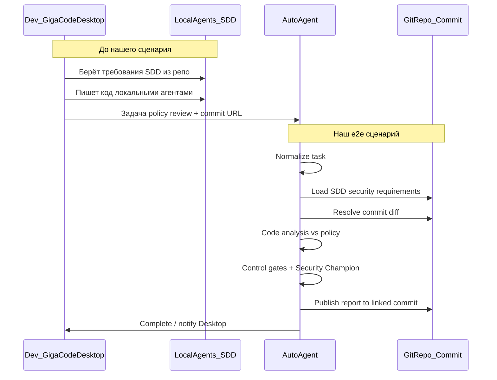

# GigaCode Desktop → Security Policy Review

Синтетический e2e-сценарий для обсуждения интеграции с **GigaCode Desktop** (форк Qwen Code Desktop).  
Каталог: Flow `gigacode-desktop-policy-review` · Playbook `security-policy-review`.

## Преамбула (вне нашего контура)

1. Разработчик берёт требования из репозитория (подход SDD).
2. Работает с кодом через локальные агенты GigaCode Desktop.
3. Ставит задачу нашему автономному агенту — например, ревью кода на cybersecurity/policy — и прикладывает **ссылку на commit**.

## Граница сценария

**Наш сценарий начинается** с приёма задачи платформой и **заканчивается** публикацией отчёта в тот же linked commit и завершением работы.

## Шаги агента (playbook)

| Шаг | Узел | Действие |
|-----|------|----------|
| Normalize | `normalize-task` (SKILL_SLOT) | Skill Task Normalizer: commit URL, repo, scope diff, policy refs |
| Load SDD | `load-sdd-security` | Читает security/cybersecurity требования из репозитория |
| Diff | `explore-diff` | Исследует changeset по linked commit |
| Analyze | `analyze-vs-policy` | Skill `code-analysis` против policy (secrets, auth, PII, injection) |
| Gates | `stage-artifact-gate` | Только обязательный каркас (проверка артефакта этапа). Доменные control packs добавляются из модуля Controls, когда они там созданы |
| Human | `security-champion` | Approve / request_changes / reject |
| Publish | `publish-to-commit` | Публикует отчёт в linked commit (comment/check) |
| END | `end` | Завершение; Desktop получает статус |

## Публикация в commit

Результат — **Code Analysis Report** (нарушения policy, severity, рекомендации), привязанный к **тому же commit URL**, который пользователь указал в запросе. Формат публикации в каталоге: `commit_comment` через capability `publisher.publish`.

## Routing (боевой путь)

- Source: `GIGACODE_DESKTOP` (Kafka/API ingress с `intent` + `commit_url`)
- Classify skill: `code-analysis` → template `generate-security-policy-review`
- Flow armed (`launched=true`): `gigacode-desktop-policy-review` → playbook `security-policy-review`
- Runtime profile: `local-lm-studio`
- Knowledge space: `slack-intake` (пока общий; можно выделить AppSec space)
- Publish: capability `publisher.publish` через `callback_url` (адаптер GigaCode/Git пишет commit comment)

## Out of scope сейчас

- Отдельный MCP-сервер GigaCode Desktop (ingress идёт через общий Kafka/API контракт)
- Отдельный git-provider внутри платформы (публикация в commit — через callback адаптера)
