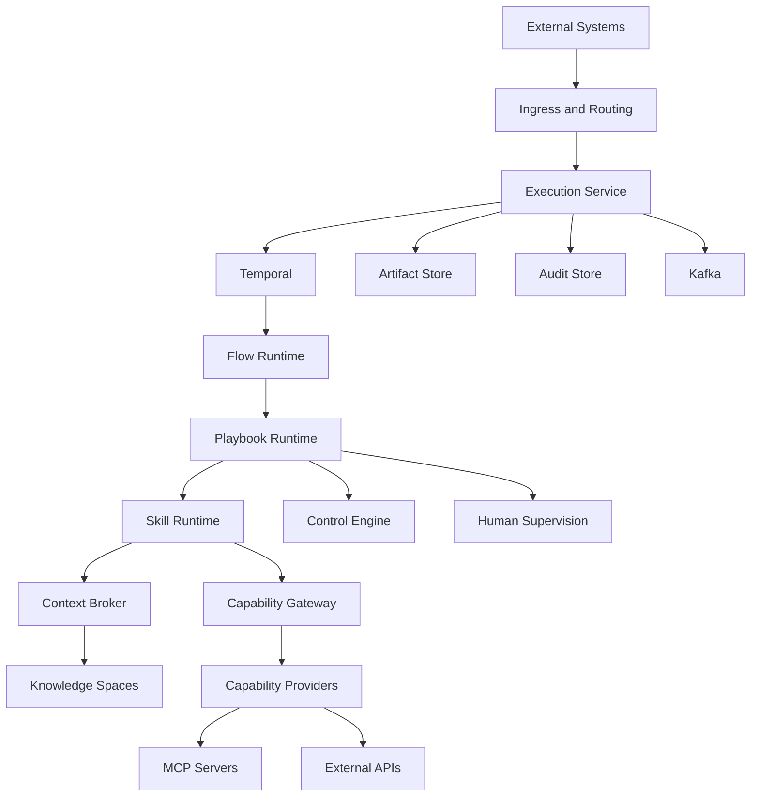

# Техническое задание для ИИ-агента разработки
## Governed AI Delivery Platform
### Версия 2.0 — миграция существующего прототипа

---

# 0. Назначение документа

Этот документ является основным техническим заданием для ИИ-агента разработки, работающего в Cursor или аналогичной IDE.

Агент должен не создавать демонстрационный продукт с нуля, а проанализировать существующий репозиторий и последовательно преобразовать текущий прототип в рабочую платформу управляемых AI-процессов.

Документ является source of truth для архитектуры, разделов продукта, API, модели данных, runtime, Temporal workflows, Kafka events, Capability Gateway и миграции прототипа.

Если текущая реализация противоречит этому документу, необходимо зафиксировать расхождение, определить миграционный путь, сохранить работоспособность существующего кода и заменить устаревшую модель новой. Нельзя переписывать проект полностью без необходимости.

---

# 1. Контекст проекта

В репозитории уже существует прототип UI и, возможно, часть backend-компонентов.

Прототип может содержать разделы Dashboard, Agents, Playbooks, Skills, Knowledge Spaces, Rules, Controls, Flows, Executions, Human Checkpoints, Audit и Playbook Designer.

Раздел `Agents` в новой модели не является самостоятельной доменной сущностью. Его необходимо удалить, временно скрыть feature flag либо мигрировать полезную конфигурацию в `Runtime Profiles`.

Основная модель платформы:

```text
External Work Item
        ↓
Routing
        ↓
Flow
        ↓
Playbook
        ↓
Playbook Steps
        ↓
Skill Slots
        ↓
Skill Implementations
        ↓
Capabilities
        ↓
Capability Gateway
        ↓
Providers / MCP Tools / APIs
```

На исполнение также влияют Rules, Controls, Knowledge Spaces, Runtime Profile, Human Supervision и Case Context.

---

# 2. Цель продукта

Платформа должна позволять компании создавать, публиковать и исполнять управляемые AI-процессы для PDLC/SDLC.

Платформа должна обеспечивать:

- повторяемость исполнения;
- регулируемость;
- контроль человеком;
- подключаемые Skills;
- независимость Skills от конкретных интеграций;
- динамический выбор источников данных;
- трассируемость решений;
- версионирование процессов;
- управление знаниями;
- выполнение долгих асинхронных процессов;
- обработку задач из внешних систем;
- заменяемость LLM runtime;
- аудит каждого шага.

---

# 3. Ключевые архитектурные принципы

## 3.1. Flow состоит из Playbooks

Flow описывает сквозной путь через несколько этапов PDLC и не содержит низкоуровневые prompt-инструкции.

## 3.2. Playbook описывает один управляемый процесс

Playbook отвечает на вопрос: как выполнить определённый тип работы в рамках одного этапа PDLC.

## 3.3. Playbook вызывает Skill Slots, а не конкретные Skills

Playbook step должен ссылаться на интерфейс, например `analysis.system_requirements.generate@1`. Конкретная реализация выбирается через binding.

## 3.4. Skill реализует одну когнитивную операцию

Skill не должен включать полный end-to-end процесс.

## 3.5. Skills не знают о MCP

Skill использует только capability identifiers:

```text
context.search
context.read
artifact.read
artifact.patch
work_item.read
publisher.publish
human.ask
```

## 3.6. Rules не изменяют процесс

Rules уточняют формат, терминологию, стиль, шаблон, уровень детализации и naming conventions. Они не могут удалить Control, пропустить обязательный этап или расширить разрешения.

## 3.7. Controls имеют приоритет

Пользователь не может отключить обязательный Control.

## 3.8. Knowledge Space отделяет Skills от источников

Knowledge Space связывает домен с Jira, Slack, Confluence, Notion, Git, API Catalog и другими источниками.

## 3.9. Execution воспроизводим

При старте необходимо зафиксировать версии Flow, Playbooks, Skills, Rules, Controls, Knowledge Space snapshot, capability bindings и Runtime Profile.

## 3.10. Runtime не зависит от UI

Frontend работает только через API.

---

# 4. Верхнеуровневая архитектура



---

# 5. Разделы системы

## 5.1. Dashboard

Назначение: показать текущее состояние платформы.

Показывать количество опубликованных Playbooks, Skills, активных Flows, executions, успешность, ошибки, approvals, нарушения Controls, среднее время исполнения и последние события.

API:

```http
GET /api/v1/dashboard/summary
GET /api/v1/dashboard/execution-trend
GET /api/v1/dashboard/top-playbooks
GET /api/v1/dashboard/pending-actions
```

## 5.2. Playbooks

Назначение: каталог управляемых процессов одного этапа PDLC.

Возможности: список, поиск, фильтры, создание, копирование, архивирование, версии, публикация, Designer, usage, executions и сравнение версий.

Семейства: Research, Analysis, Architecture, Development, Testing, DevOps, Operations, Cross-cutting Review.

API:

```http
GET    /api/v1/playbooks
POST   /api/v1/playbooks
GET    /api/v1/playbooks/{playbookId}
PATCH  /api/v1/playbooks/{playbookId}
DELETE /api/v1/playbooks/{playbookId}
GET    /api/v1/playbooks/{playbookId}/versions
POST   /api/v1/playbooks/{playbookId}/versions
GET    /api/v1/playbooks/{playbookId}/versions/{versionId}
POST   /api/v1/playbooks/{playbookId}/versions/{versionId}/publish
POST   /api/v1/playbooks/{playbookId}/versions/{versionId}/validate
POST   /api/v1/playbooks/{playbookId}/versions/{versionId}/clone
GET    /api/v1/playbooks/{playbookId}/usage
```

Состояния версии: DRAFT, VALIDATING, READY, PUBLISHED, DEPRECATED, ARCHIVED.

## 5.3. Playbook Designer

Назначение: отдельная low-code IDE для создания внутренней структуры Playbook.

Левая панель содержит Skill Slot, Locked Step, Adaptive Zone, Human Checkpoint, Control Gate, Conditional Branch, Parallel Branch, Merge, Artifact Boundary и Publication Step.

Canvas поддерживает добавление элементов, изменение порядка, ветвление, zoom, minimap, undo/redo, shortcuts, autosave, validation и simulation.

Inspector редактирует выбранный элемент.

API:

```http
GET   /api/v1/playbooks/{playbookId}/versions/{versionId}/graph
PUT   /api/v1/playbooks/{playbookId}/versions/{versionId}/graph
POST  /api/v1/playbooks/{playbookId}/versions/{versionId}/graph/validate
POST  /api/v1/playbooks/{playbookId}/versions/{versionId}/graph/simulate
GET   /api/v1/playbooks/{playbookId}/versions/{versionId}/graph/problems
```

Публикация запрещена, если отсутствуют start или terminal node, есть недостижимые шаги, цикл без loop policy, Skill Slot без interface, отсутствует реализация, удалён Locked Step, несовместимы contracts или Human Checkpoint не имеет approver policy.

## 5.4. Skills

Назначение: каталог реализаций Skill Slot interfaces.

Типы: CORE, CORPORATE, TEAM, USER, IMPORTED.

Минимальная структура пакета:

```text
skill/
├── SKILL.md
├── manifest.yaml
├── examples/
├── schemas/
└── tests/
```

Пример manifest:

```yaml
id: team-system-requirements
name: Team System Requirements Generator
version: 1.4.0
implements:
  - analysis.system_requirements.generate@1
required_capabilities:
  - context.search
  - context.read
  - artifact.read
  - artifact.patch
input_contract: ProblemUnderstandingArtifact@1
output_contract: SystemRequirementsPatch@1
runtime:
  type: qwen-code-cli
  timeout_seconds: 900
```

API:

```http
GET    /api/v1/skills
POST   /api/v1/skills
GET    /api/v1/skills/{skillId}
PATCH  /api/v1/skills/{skillId}
DELETE /api/v1/skills/{skillId}
POST   /api/v1/skills/import
GET    /api/v1/skills/{skillId}/versions
POST   /api/v1/skills/{skillId}/versions
POST   /api/v1/skills/{skillId}/versions/{versionId}/validate
POST   /api/v1/skills/{skillId}/versions/{versionId}/test
POST   /api/v1/skills/{skillId}/versions/{versionId}/publish
GET    /api/v1/skills/{skillId}/usage
GET    /api/v1/skill-interfaces
POST   /api/v1/skill-interfaces
GET    /api/v1/skill-interfaces/{interfaceKey}
```

## 5.5. Rules

Назначение: изменяемые правила оформления и выполнения.

Уровни: PLATFORM, ORGANIZATION, DOMAIN, TEAM, FLOW, PLAYBOOK, EXECUTION.

Приоритет: PLATFORM < ORGANIZATION < DOMAIN < TEAM < FLOW < PLAYBOOK < EXECUTION.

API:

```http
GET    /api/v1/rules
POST   /api/v1/rules
GET    /api/v1/rules/{ruleId}
PATCH  /api/v1/rules/{ruleId}
DELETE /api/v1/rules/{ruleId}
GET    /api/v1/rules/{ruleId}/versions
POST   /api/v1/rules/{ruleId}/versions
POST   /api/v1/rules/{ruleId}/versions/{versionId}/publish
POST   /api/v1/rules/resolve
```

## 5.6. Knowledge Spaces

Назначение: логическая область знаний для Context Broker.

Содержит source bindings, scope filters, access policies, indexing configuration, freshness и ranking policies.

API:

```http
GET    /api/v1/knowledge-spaces
POST   /api/v1/knowledge-spaces
GET    /api/v1/knowledge-spaces/{spaceId}
PATCH  /api/v1/knowledge-spaces/{spaceId}
DELETE /api/v1/knowledge-spaces/{spaceId}
GET    /api/v1/knowledge-spaces/{spaceId}/sources
POST   /api/v1/knowledge-spaces/{spaceId}/sources
PATCH  /api/v1/knowledge-spaces/{spaceId}/sources/{sourceId}
DELETE /api/v1/knowledge-spaces/{spaceId}/sources/{sourceId}
POST   /api/v1/knowledge-spaces/{spaceId}/search
POST   /api/v1/knowledge-spaces/{spaceId}/test
GET    /api/v1/knowledge-spaces/{spaceId}/health
```

Context Broker должен выбрать источники, проверить доступ, выполнить поиск, нормализовать результаты, удалить дубликаты, рассчитать relevance и freshness, сформировать Evidence Bundle и Evidence Ledger.

## 5.7. Controls

Назначение: обязательные ограничения, проверки, approvals и evidence requirements.

Уровни: REGULATORY, CORPORATE, DOMAIN, PLAYBOOK, RUNTIME_RISK.

API:

```http
GET    /api/v1/controls
POST   /api/v1/controls
GET    /api/v1/controls/{controlId}
PATCH  /api/v1/controls/{controlId}
GET    /api/v1/control-packs
POST   /api/v1/control-packs
GET    /api/v1/control-packs/{packId}
POST   /api/v1/control-packs/{packId}/versions
POST   /api/v1/control-packs/{packId}/versions/{versionId}/publish
POST   /api/v1/controls/evaluate
POST   /api/v1/controls/resolve
```

Режим supervision определяется максимальной строгостью regulatory, corporate, domain, playbook и runtime risk policies.

## 5.8. Flows

Назначение: сквозная оркестрация нескольких Playbooks.

Flow содержит triggers, routing conditions, stages, Playbook references, transitions, branch conditions, handoff contracts, completion policy и Runtime Profile.

API:

```http
GET    /api/v1/flows
POST   /api/v1/flows
GET    /api/v1/flows/{flowId}
PATCH  /api/v1/flows/{flowId}
GET    /api/v1/flows/{flowId}/versions
POST   /api/v1/flows/{flowId}/versions
POST   /api/v1/flows/{flowId}/versions/{versionId}/validate
POST   /api/v1/flows/{flowId}/versions/{versionId}/publish
POST   /api/v1/flows/{flowId}/versions/{versionId}/simulate
GET    /api/v1/flows/{flowId}/usage
```

## 5.9. Runtime Profiles

Назначение: техническая конфигурация исполнения, заменяющая устаревшую сущность Agent.

Содержит LLM provider, model, fallback models, generation settings, sandbox policy, concurrency, retries, cost limits, context limits, providers, secrets reference и region.

API:

```http
GET    /api/v1/runtime-profiles
POST   /api/v1/runtime-profiles
GET    /api/v1/runtime-profiles/{profileId}
PATCH  /api/v1/runtime-profiles/{profileId}
DELETE /api/v1/runtime-profiles/{profileId}
POST   /api/v1/runtime-profiles/{profileId}/validate
POST   /api/v1/runtime-profiles/{profileId}/test
```

## 5.10. Executions

Назначение: просмотр и управление запусками Flow или Playbook.

API:

```http
GET    /api/v1/executions
POST   /api/v1/executions
GET    /api/v1/executions/{executionId}
POST   /api/v1/executions/{executionId}/cancel
POST   /api/v1/executions/{executionId}/pause
POST   /api/v1/executions/{executionId}/resume
POST   /api/v1/executions/{executionId}/retry
GET    /api/v1/executions/{executionId}/snapshot
GET    /api/v1/executions/{executionId}/events
```

Состояния: CREATED, ROUTING, PLANNING, RUNNING, WAITING_HUMAN, WAITING_EXTERNAL, PAUSED, COMPLETED, FAILED, CANCELLED, TIMED_OUT.

## 5.11. Execution Inspector

Назначение: расследование и наблюдение за конкретным Execution.

Вкладки: Overview, Plan, Playbook Runs, Skill Runs, Artifact, Evidence, Capability Calls, Approvals, Events, Audit, Raw Snapshot.

API:

```http
GET /api/v1/executions/{executionId}/plan
GET /api/v1/executions/{executionId}/playbook-runs
GET /api/v1/executions/{executionId}/skill-runs
GET /api/v1/executions/{executionId}/artifact
GET /api/v1/executions/{executionId}/artifact/versions
GET /api/v1/executions/{executionId}/evidence
GET /api/v1/executions/{executionId}/capability-calls
GET /api/v1/executions/{executionId}/control-results
GET /api/v1/executions/{executionId}/approvals
GET /api/v1/executions/{executionId}/audit
```

## 5.12. Human Checkpoints

Назначение: очередь решений, требующих участия человека.

API:

```http
GET  /api/v1/approvals
GET  /api/v1/approvals/{approvalId}
POST /api/v1/approvals/{approvalId}/approve
POST /api/v1/approvals/{approvalId}/reject
POST /api/v1/approvals/{approvalId}/request-changes
POST /api/v1/approvals/{approvalId}/provide-input
POST /api/v1/approvals/{approvalId}/escalate
```

## 5.13. Integrations

Назначение: подключения к work item sources, knowledge sources, publishers, code providers, identity providers, MCP servers и notifications.

API:

```http
GET    /api/v1/integrations
POST   /api/v1/integrations
GET    /api/v1/integrations/{integrationId}
PATCH  /api/v1/integrations/{integrationId}
DELETE /api/v1/integrations/{integrationId}
POST   /api/v1/integrations/{integrationId}/test
GET    /api/v1/integrations/{integrationId}/health
POST   /api/v1/integrations/{integrationId}/discover
```

## 5.14. Capability Registry

Назначение: каталог стабильных абстрактных возможностей платформы.

API:

```http
GET    /api/v1/capabilities
POST   /api/v1/capabilities
GET    /api/v1/capabilities/{capabilityId}
PATCH  /api/v1/capabilities/{capabilityId}
GET    /api/v1/capability-providers
POST   /api/v1/capability-providers
GET    /api/v1/capability-providers/{providerId}
PATCH  /api/v1/capability-providers/{providerId}
POST   /api/v1/capability-providers/{providerId}/test
POST   /api/v1/capabilities/resolve
POST   /api/v1/capabilities/invoke
```

## 5.15. Audit

Назначение: неизменяемая история действий и решений.

API:

```http
GET /api/v1/audit/events
GET /api/v1/audit/events/{eventId}
GET /api/v1/audit/export
```

---

# 6. Модель данных

Основные таблицы:

```text
Workspace(id, key, name, description, status, created_at, updated_at)
Playbook(id, workspace_id, key, name, description, family, owner_team_id, current_published_version_id, status)
PlaybookVersion(id, playbook_id, version_number, semantic_version, status, graph_json, input_contract_key, output_contract_key)
PlaybookStep(id, playbook_version_id, step_key, step_type, name, position, interface_key, configuration_json, immutable)
SkillInterface(id, key, major_version, name, description, input_contract_key, output_contract_key, required_capabilities, status)
Skill(id, workspace_id, key, name, description, type, status, owner_team_id, current_published_version_id)
SkillVersion(id, skill_id, semantic_version, status, manifest_json, skill_markdown, package_uri, checksum, runtime_type)
SkillImplementation(id, skill_version_id, skill_interface_id, compatibility_status, validation_report)
SkillBinding(id, scope_type, scope_id, playbook_step_key, skill_interface_id, skill_version_id, priority, conditions_json, enabled)
Rule(id, workspace_id, key, name, scope_type, scope_selector, status, current_published_version_id)
RuleVersion(id, rule_id, semantic_version, content, priority, status)
KnowledgeSpace(id, workspace_id, key, name, description, status, access_policy_json, ranking_policy_json)
KnowledgeSourceBinding(id, knowledge_space_id, integration_id, source_type, source_selector, priority, freshness_policy_json, enabled)
ControlPack(id, key, name, level, description, status, current_published_version_id)
ControlPackVersion(id, control_pack_id, semantic_version, definition_json, status)
Flow(id, workspace_id, key, name, description, status, current_published_version_id)
FlowVersion(id, flow_id, semantic_version, graph_json, runtime_profile_id, status)
RuntimeProfile(id, workspace_id, key, name, provider, model, fallback_models, generation_config, sandbox_config, limits_json, secrets_reference, status)
Execution(id, workspace_id, external_reference, source_type, source_payload, flow_version_id, playbook_version_id, runtime_profile_id, knowledge_space_id, status, current_stage_key, current_step_key, progress, timestamps, error fields)
ExecutionSnapshot(id, execution_id, snapshot_json, checksum, created_at)
PlaybookRun(id, execution_id, playbook_version_id, stage_key, status, timestamps)
SkillRun(id, playbook_run_id, playbook_step_key, skill_version_id, status, attempt, input_artifact_version_id, output_patch_id, token_usage_json, timestamps, error_json)
CaseContext(id, execution_id, charter_json, scope_json, decisions_json, open_questions_json, conflicts_json, applicable_controls_json)
Artifact(id, execution_id, artifact_type, current_version_id, status)
ArtifactVersion(id, artifact_id, version_number, content_json, content_markdown, schema_version, created_by_type, created_by_id, created_at)
ArtifactPatch(id, artifact_id, base_version_id, patch_json, rationale, evidence_refs, created_by_skill_run_id, status)
Evidence(id, execution_id, source_binding_id, source_type, source_reference, title, excerpt, metadata_json, content_hash, relevance_score, freshness_score, retrieved_at)
CapabilityCall(id, execution_id, skill_run_id, capability_key, provider_id, request_json, response_summary_json, status, timestamps, error_json)
ApprovalRequest(id, execution_id, playbook_run_id, step_key, mode, requested_role, status, payload_json, deadline_at, timestamps)
ApprovalDecision(id, approval_request_id, decision, actor_id, comment, input_json, created_at)
AuditEvent(id, workspace_id, execution_id, actor_type, actor_id, event_type, entity_type, entity_id, payload_json, occurred_at, previous_hash, event_hash)
```

Опубликованные версии запрещено изменять in-place.

---

# 7. Логика работы платформы

## 7.1. Получение задачи

Ingress проверяет подпись, нормализует payload в WorkRequest, сохраняет raw payload, выполняет idempotency check, публикует событие и запускает routing.

## 7.2. Routing

Router определяет workspace, Flow, Knowledge Space, Runtime Profile, Rules и Controls. Результат должен быть объяснимым и сохранять routing reasons.

## 7.3. Execution Snapshot

До начала исполнения замораживаются версии Flow, Playbooks, Skill Bindings, Skills, Rules, Controls, Capability Providers, Runtime Profile и Knowledge Space bindings.

## 7.4. Temporal Workflow

Запускается ExecutionWorkflow, который создаёт Case Context, строит план, запускает stages и child workflows Playbooks, ожидает approvals и публикует события.

## 7.5. Выполнение Playbook

Runtime загружает frozen graph, проверяет Controls, создаёт PlaybookRun, выполняет шаги, сохраняет state, валидирует output contract и делает handoff следующему stage.

## 7.6. Выполнение Skill Slot

Runtime получает interface, находит binding, проверяет contracts, формирует Stage Brief, Rules Bundle, Evidence Bundle и Artifact Snapshot, запускает Skill, получает Artifact Patch, валидирует и применяет patch, создаёт новую ArtifactVersion и обновляет Case Context.

## 7.7. Контекст Skill Run

Skill получает только Task Charter, Scope, Stage Goal, Artifact Snapshot, Evidence Bundle, Rules, Controls, Open Questions, Output Contract, Allowed Capabilities и Context Budget.

## 7.8. Adaptive Zone

Adaptive Zone может выбирать дополнительные действия, но ограничена разрешёнными capabilities, tokens, временем, числом действий и не может пропустить Locked Step.

## 7.9. Capability Resolution

Gateway фильтрует providers по policy, health, Knowledge Space, priority и data classification, выбирает provider, логирует решение и нормализует ответ.

## 7.10. Human Checkpoint

Создать ApprovalRequest, перевести Execution в WAITING_HUMAN, отправить уведомление, ждать Temporal signal, проверить роль и сохранить решение.

## 7.11. Controls Evaluation

Controls проверяются при routing, snapshot, перед Playbook, перед capability call, перед публикацией и после исполнения при review-after.

## 7.12. Publication

Publisher получает только утверждённый ArtifactVersion. Проверяются Controls, approval, permissions и idempotency.

---

# 8. Temporal

Workflows:

```text
ExecutionWorkflow
PlaybookWorkflow
SkillRunWorkflow, если Skill требует длительного ожидания
```

Activities:

```text
LoadExecutionSnapshotActivity
CreateCaseContextActivity
ResolveControlsActivity
BuildExecutionPlanActivity
CreatePlaybookRunActivity
ResolveSkillBindingActivity
BuildSkillContextActivity
RunSkillActivity
ValidateArtifactPatchActivity
ApplyArtifactPatchActivity
InvokeCapabilityActivity
CreateApprovalActivity
PublishEventActivity
FinalizeExecutionActivity
```

Signals:

```text
approval_received
input_provided
pause_requested
resume_requested
cancel_requested
external_event_received
```

Queries:

```text
get_execution_state
get_current_stage
get_current_step
get_pending_approval
get_progress
```

---

# 9. Kafka

Event envelope должен содержать eventId, eventType, eventVersion, occurredAt, workspaceId, executionId, correlationId, causationId, actor и payload.

Topics:

```text
work-request-events
execution-events
playbook-run-events
skill-run-events
capability-call-events
artifact-events
approval-events
control-events
audit-events
integration-events
```

Основные события:

```text
work-request.received
work-request.routed
execution.created
execution.started
execution.paused
execution.resumed
execution.completed
execution.failed
playbook-run.started
playbook-run.completed
skill-run.started
skill-run.completed
skill-run.failed
artifact.patch.created
artifact.version.created
capability.call.started
capability.call.completed
approval.requested
approval.resolved
control.violated
publication.completed
```

---

# 10. API conventions

Base path: `/api/v1`.

Response envelope:

```json
{"data":{},"meta":{"requestId":"uuid"}}
```

Error envelope должен содержать code, message, details и requestId.

Использовать cursor pagination, optimistic locking и `Idempotency-Key` для запуска Execution и публикации.

---

# 11. Backend modules

```text
backend/modules/
├── identity
├── workspace
├── playbooks
├── skills
├── rules
├── knowledge-spaces
├── controls
├── flows
├── runtime-profiles
├── executions
├── artifacts
├── evidence
├── approvals
├── capabilities
├── integrations
├── audit
└── dashboard
```

Каждый модуль содержит domain, application, infrastructure, api и tests. Бизнес-логику запрещено помещать целиком в HTTP controllers.

---

# 12. Frontend modules

```text
frontend/src/pages/
├── dashboard
├── playbooks
├── playbook-designer
├── skills
├── rules
├── knowledge-spaces
├── controls
├── flows
├── runtime-profiles
├── executions
├── execution-inspector
├── approvals
├── integrations
└── audit
```

Сохранить стилистику прототипа: тёмная навигация, светлая рабочая область, компактные таблицы, мягкие тени, синие actions, status pills и fullscreen Designer.

Статические страницы постепенно заменить реальными routes и API data.

---

# 13. Безопасность

Роли:

```text
PlatformAdmin
WorkspaceAdmin
ProcessDesigner
SkillDeveloper
ComplianceOfficer
Operator
Approver
Viewer
Auditor
```

Разрешения должны быть granular. Секреты не хранить открытым текстом. Учитывать data classification PUBLIC, INTERNAL, CONFIDENTIAL, RESTRICTED.

---

# 14. Нефункциональные требования

Использовать idempotent activities, retries, durable workflows, outbox pattern, optimistic locking, DLQ и graceful degradation.

Цели MVP:

- list API p95 < 500 ms;
- detail API p95 < 700 ms;
- dashboard p95 < 1 s;
- capability routing overhead p95 < 150 ms;
- UI initial load < 3 s.

Поддержать 10 000 Playbooks, 50 000 Skill versions, 100 000 executions в месяц, 1 000 concurrent workflows и 300+ MCP tools.

Использовать OpenTelemetry, traces, metrics, structured logs и correlation IDs.

---

# 15. Порядок реализации

## Фаза 0. Аудит

Создать:

```text
docs/CURRENT_STATE.md
docs/TARGET_ARCHITECTURE.md
docs/MIGRATION_PLAN.md
docs/IMPLEMENTATION_STATUS.md
```

## Фаза 1. Application Shell

Обновить navigation, удалить Agents, добавить Runtime Profiles, сохранить дизайн и добавить route stubs.

## Фаза 2. Базовый backend

Workspace, PostgreSQL, migrations, auth, RBAC, audit и API conventions.

## Фаза 3. Playbooks и Designer

CRUD, versions, graph, validation, publication и UI.

## Фаза 4. Skills и interfaces

Catalog, import, manifests, validation, bindings и tests.

## Фаза 5. Rules, Knowledge Spaces, Controls

CRUD, resolvers, source bindings и control evaluation.

## Фаза 6. Flows и Runtime Profiles

Flow versions, graph, contracts и runtime configuration.

## Фаза 7. Execution runtime

Execution Service, snapshots, Temporal, Kafka, PlaybookRuntime и SkillRuntime.

## Фаза 8. Artifact and Evidence

Case Context, artifacts, patches, evidence ledger и Inspector.

## Фаза 9. Human supervision

Approvals, notifications, Temporal signals, SLA и escalation.

## Фаза 10. Capability Gateway

Registry, providers, MCP discovery, quarantine, resolver и policy enforcement.

## Фаза 11. End-to-end vertical slice

```text
Jira Work Item
  ↓
System Requirements Flow
  ↓
System Requirements Playbook
  ↓
Problem Understanding Skill
  ↓
Context Search
  ↓
Requirements Generation Skill
  ↓
Regulatory Validation
  ↓
Human Approval
  ↓
Publish to Jira or Confluence
```

---

# 16. Definition of Done

Функция завершена, если реализована бизнес-логика, API документирован, миграция БД создана, backend и frontend tests добавлены, RBAC и audit работают, UI имеет loading, empty и error states, production path не использует mocks, Docker Compose запускается, lint и typecheck проходят, end-to-end тест проходит.

---

# 17. Запрещённые упрощения

Запрещено:

- оставлять Agents центральной сущностью;
- связывать Skill напрямую с Jira, Slack или Confluence;
- передавать Skill полный список MCP tools;
- хранить MCP tool name в Skill;
- выполнять Playbook как один огромный prompt;
- хранить Artifact без версий;
- разрешать удаление обязательных Controls;
- менять опубликованную версию in-place;
- использовать UI state как source of truth;
- выполнять внешние вызовы из Temporal workflow code;
- хранить secrets в JSON;
- заменять реальные API mock-ответами;
- создавать новый репозиторий вместо миграции текущего без необходимости.

---

# 18. Первое задание ИИ-агенту

1. Просканировать текущий репозиторий.
2. Не удалять существующие файлы.
3. Определить frontend, backend, database и infrastructure stack.
4. Найти HTML-прототип.
5. Найти раздел Agents и связанные модели.
6. Определить данные для миграции в Runtime Profiles.
7. Создать CURRENT_STATE, TARGET_ARCHITECTURE, MIGRATION_PLAN и IMPLEMENTATION_STATUS.
8. Создать ADR `docs/adr/ADR-001-remove-agent-domain-entity.md`.
9. Предложить первый небольшой PR.
10. Первый PR обновляет navigation, заменяет Agents на Runtime Profiles, сохраняет стиль, не ломает страницы и добавляет route tests.
11. После каждого этапа обновлять IMPLEMENTATION_STATUS.
12. Не переходить к следующей крупной фазе, пока текущая не проходит тесты.

---

# 19. Критерии приёмки MVP

Пользователь может создать Skill Interface, импортировать Skill, создать Rules, Knowledge Space и Control Pack, создать Playbook в Designer, добавить Skill Slots, привязать Skills, опубликовать Playbook, создать Flow, Runtime Profile, запустить Execution, увидеть progress, пройти Human Checkpoint, просмотреть Artifact и Evidence, опубликовать результат, увидеть Audit и повторить Execution по snapshot.

---

# 20. Итоговое меню

```text
Dashboard

Build
├── Playbooks
├── Skills
├── Rules
├── Knowledge Spaces
├── Flows
└── Runtime Profiles

Run
├── Executions
├── Human Checkpoints
└── Execution Inspector

Govern
├── Controls
├── Integrations
├── Capability Registry
└── Audit
```

---

# 21. Главная модель продукта

```text
Flow
  └── Playbook
        ├── Locked Step
        ├── Skill Slot
        │     └── Skill Implementation
        ├── Adaptive Zone
        ├── Control Gate
        └── Human Checkpoint

Execution
  ├── Frozen Snapshot
  ├── Case Context
  ├── Artifact Versions
  ├── Evidence Ledger
  ├── Capability Calls
  ├── Human Decisions
  └── Audit Events
```

Эта модель должна быть отражена в коде, API, БД, UI, Temporal workflows, Kafka events и документации.
